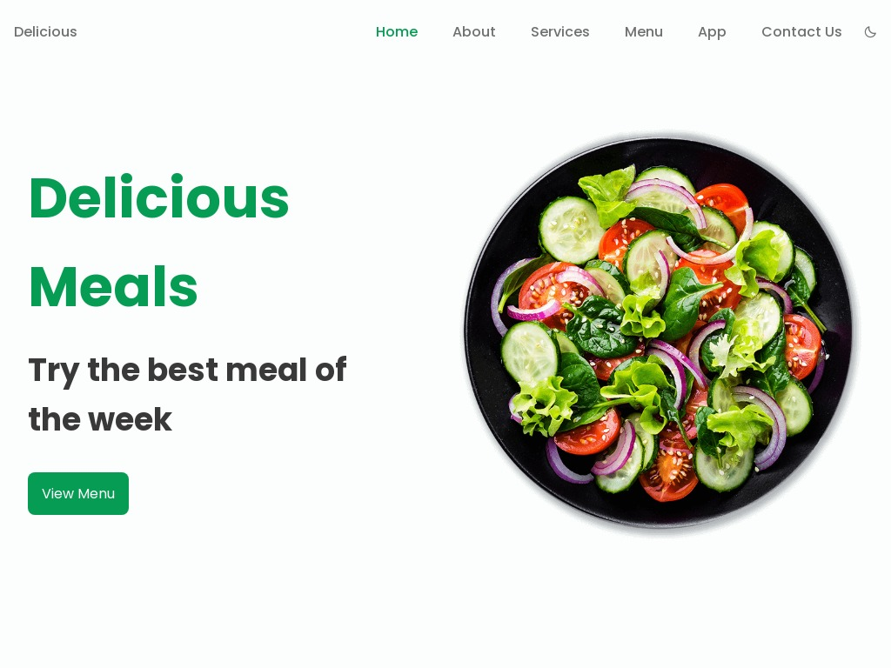
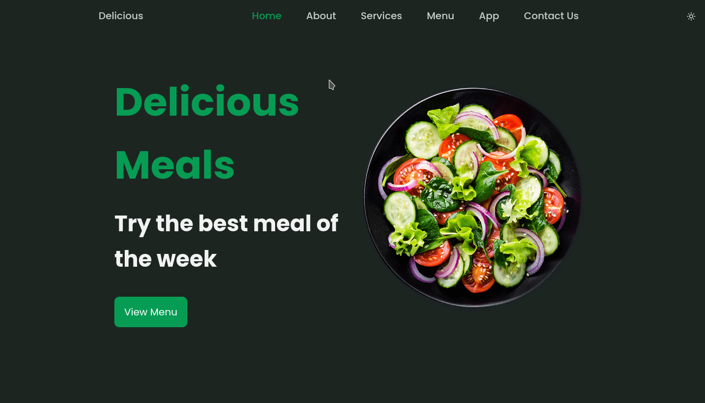
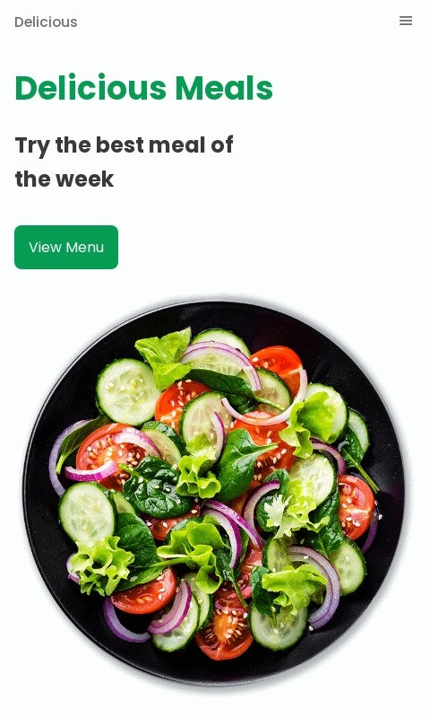
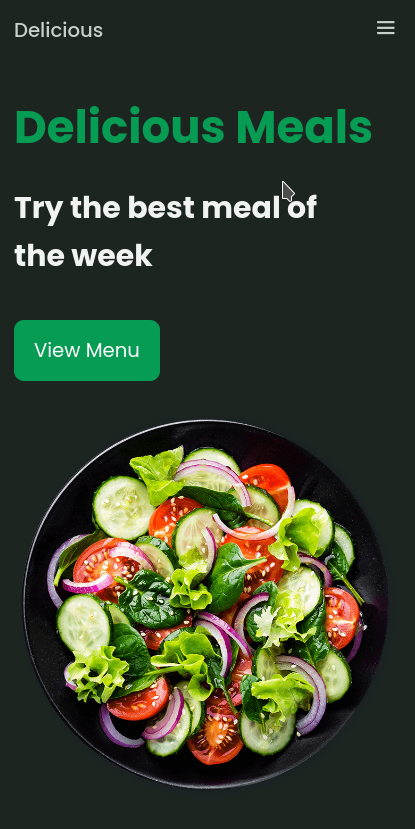

# [Delicious Meals](https://delicious-meals.netlify.app)

Responsive landing page for restaurant build with HTML CSS & JavaScript and ScrollReveal JS library.

## Features
- [x] Highlight Active Link
- [x] Fully responsive
- [x] Dark Mode
- [x] Animation on Scroll
- [x] Custom Scrollbar
- [x] Show and Hide Scroll to top Page

# Home

## Desktop Light

## Desktop Dark

## Mobile Light

## Mobile Dark

